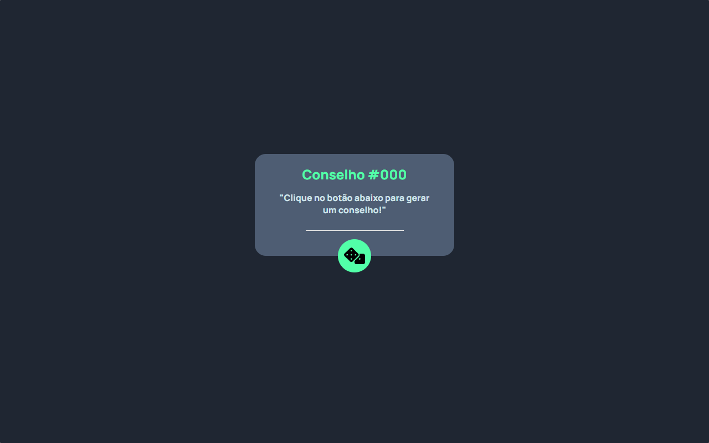
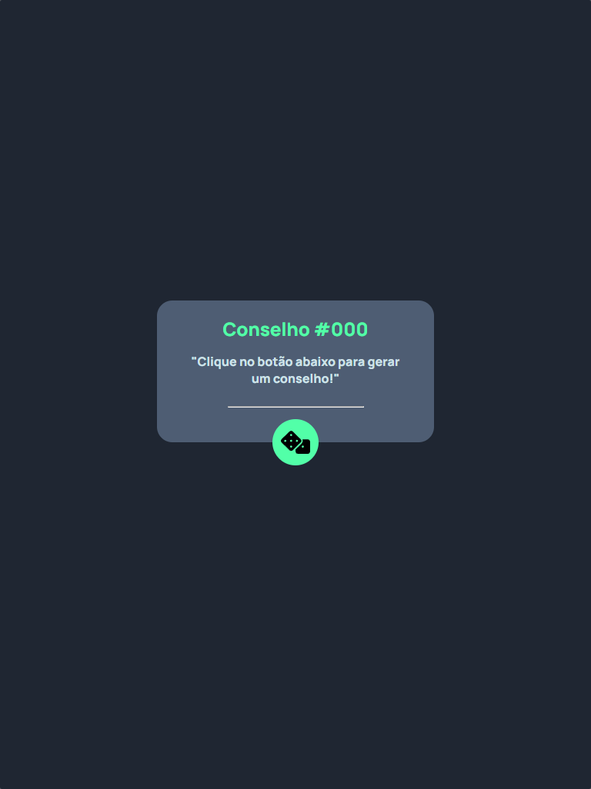
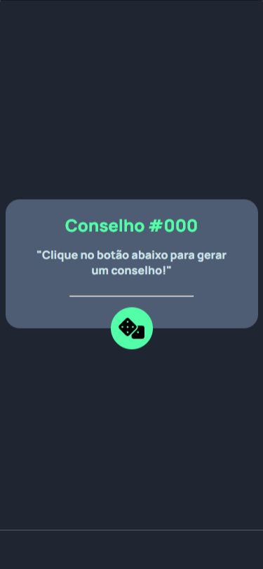

# Frontend Mentor - solução de aplicativo gerador de conselhos

Esta é uma solução para o [Advice generator app challenge on Frontend Mentor](https://www.frontendmentor.io/challenges/advice-generator-app-QdUG-13db).

## Índice

- [Visão geral](#visão-geral)
   - [O desafio](#o-desafio)
   - [Captura de tela](#captura-de-tela)
- [Meu processo](#meu-processo)
   - [Construído com](#construído-com)
   - [O que aprendi](#o-que-aprendi)
   - [Desenvolvimento contínuo](#desenvolvimento-contínuo)
- [Autor](#autor)

## Visão geral

### O desafio

Os usuários devem ser capazes de:

- Ver o layout ideal para o aplicativo, dependendo do tamanho da tela do dispositivo
- Veja os estados de foco para todos os elementos interativos na página
- Gere um novo conselho clicando no ícone do dado

### Captura de tela





## Meu processo

### Construído com

- Marcação HTML5 semântica
- Propriedades personalizadas CSS
- Flexbox
- API Advice Slip
- Clean code
- Funções JavaScript 
- Async e Await

### O que aprendi

Este é meu primeiro projeto usando uma API, mas consegui entender bastante como funciona uma API por "de baixo dos panos" e seus metodos como por exemplo o "fetch". Consegui reforçar meus conhecimentos em funções assincronas e sincronas e como elas funcionam e entendi melhor o async e await. 

```js
let btn = document.querySelector(`.botao`)

async function gerarConselho() {
    const url = `https://api.adviceslip.com/advice`
    const resposta = await fetch(url)
    return await resposta.json()
}

btn.addEventListener(`click`, async () => {
    const conselho = await gerarConselho()

    let mostrarConselho = document.getElementById(`conselho`)
    let numeroDoConselho = document.getElementById('numero-do-conselho')

    mostrarConselho.innerHTML = `"${conselho.slip.advice}"`
    numeroDoConselho.innerHTML = `Conselho #${conselho.slip.id}`
})
```

### Desenvolvimento contínuo

Pretendo continuar reforçando meus conhecimentos sobre async e await e APIs pois ainda não me sinto muito confiante, mas estou empolgado para aprender mais

## Autor

- Frontend Mentor - [@luis-fernand0](https://www.frontendmentor.io/profile/luis-fernand0)